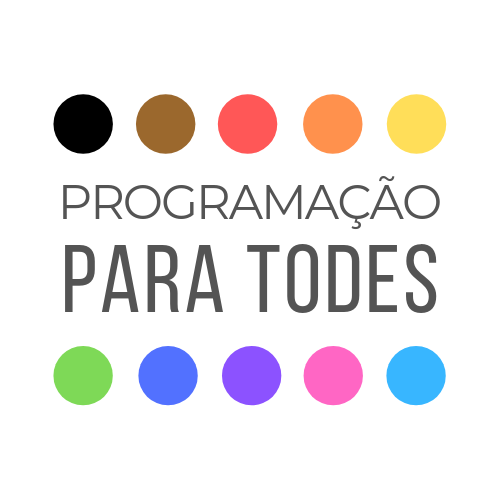

O **Programação para Todes** foi ficado para promover a diversidade e a equidade na área de TI. 

A ideia inicial era ministrar aulas presenciais, porém, na falta de um local físico, o projeto ainda não tinha começado.

Quando iniciamos o isolamento social por conta do COVID-19, resolvi oferecer as aulas online e tem dado muito certo! \o/

**As aulas são totalmente gratuitas, uma das premissas do projeto.**

Após cada aula, preparo um resumão com o que foi visto naquele dia e acrescento mais algumas coisinhas. 

No final de cada aula, há uma pequena lista com exercícios e um desafio.

Até o momento, tivemos as seguintes aulas:

[Aula 01](Aula01.md)

[Aula 02](Aula02.md)

[Aula 03](Aula03.md)

[Aula 04](Aula04.md)

O conteúdo das aulas até o presente momento é sobre **Lógica de Programação** e [**Python**](https://github.com/python).

Para as aulas online, utilizamos o [Jitsi](https://github.com/jitsi), um projeto open source muito maneiro!

---

Para maiores informações sobre o projeto, mande um e-mail programacaoparatodes@gmail.com :)

